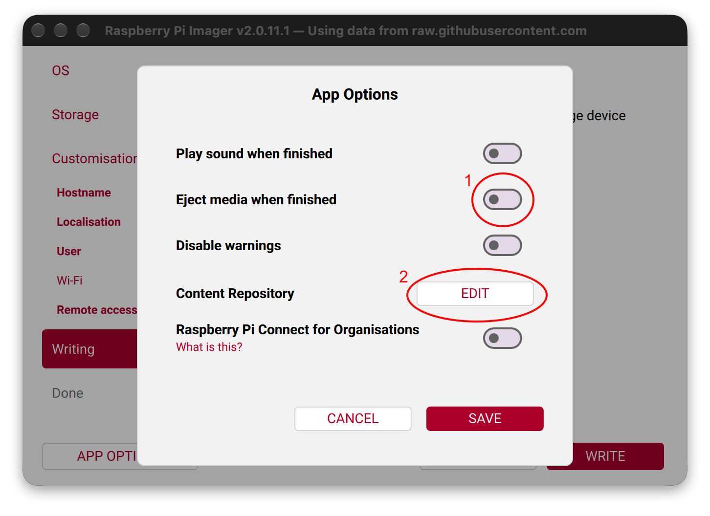

# electroPioreactor-plugin

A [Pioreactor](https://pioreactor.com) community plugin for the **[electroPioreactor](https://electroPioreactor.org)** – any Pioreactor fitted with an electrode pair driven by an LED channel and a CO₂ solenoid driven by a PWM channel.

Provides a single background job, **electroPioreactor**, that:

- Drives electrolysis (via the configured LED channel, default **D**) at a user-defined power level (0–10 %, clamped at runtime to protect the electrodes).
- **Cycles electrolysis ON/OFF** on a user-defined schedule (`electrolysis_on_seconds` ON, then `electrolysis_off_seconds` OFF, repeating). Set the OFF time to `0` for continuous electrolysis.
- Sparges CO₂ by periodically opening a CO₂ solenoid (the configured PWM channel, default **4**) for a user-defined duration, at a user-defined interval in minutes.
- Pauses electrolysis (LED → 0 %) for the duration of each sparge and resumes it immediately after.
- Pauses the `od_reading` job around each electrolysis ON phase (plus a user-defined window) and, independently, around each CO₂ sparge, so OD samples aren't contaminated by electrolysis or bubbles.

All electrolysis and sparging parameters are editable live from the Pioreactor web interface. The LED and PWM channels are set in `config.ini` (they're hardware bindings, not runtime settings — see **Hardware connections**).

### Electrolysis ON/OFF cycling

- `electrolysis_on_seconds` (default `60.0`) – how long electrolysis is ON each cycle. Must be > 0.
- `electrolysis_off_seconds` (default `0.0`) – how long electrolysis is OFF between ON phases. Must be ≥ 0; `0` = continuous electrolysis (no OFF phase, identical to the pre-v0.7 behaviour).

A mid-cycle change applies to the **next** phase, not the in-flight one.

### OD pausing around electrolysis

`od_pause_after_electrolysis_seconds` (default `5.0`) is the settle window **after each electrolysis ON phase ends** before OD reading resumes. The effective OD-suppression window, measured from the start of the ON phase, is:

```
od_pause_window = electrolysis_on_seconds + od_pause_after_electrolysis_seconds   (floored at 0)
```

This value is **allowed to go negative**, down to (and below) −`electrolysis_on_seconds`. A negative value eats into the ON-phase pause, so OD resumes *before* electrolysis ends and OD is measured **during** electrolysis. Worked example with `electrolysis_on_seconds = 10`:

| `od_pause_after_electrolysis_seconds` | window | behaviour |
|---|---|---|
| `+5` | `15` | OD off for the 10 s ON phase + 5 s settle after. Typical. |
| `0`  | `10` | OD off for exactly the ON phase. |
| `−3` | `7`  | OD resumes at t = 7 s, **3 s before electrolysis ends** → OD measured during the tail of electrolysis. |
| `−10` (= −on) | `0` | OD never paused → OD measured throughout electrolysis. |
| `−99999` | `0` | clamped to 0; disables this OD pause entirely. |

### OD pausing around sparging

`od_pause_after_sparge_seconds` (default `5.0`) is the bubble-clearance window **after the CO₂ solenoid closes** before OD reading resumes. The total OD pause window is `sparge_duration_seconds + od_pause_after_sparge_seconds`, measured from sparge start, and follows the same positive/zero/negative rules as the electrolysis OD pause (negatives down to −`sparge_duration_seconds` shorten or cancel the pause).

Pause/resume is done by publishing `JobState.SLEEPING`/`READY` to `od_reading`'s `$state/set` topic. If `od_reading` isn't running, the publish is a no-op.

## Hardware connections

The electrode pair drives an LED channel and the CO₂ solenoid drives a PWM channel; **both are configurable** in `~/.pioreactor/config.ini` so the plugin doesn't assume a fixed channel is free (e.g. if other jobs occupy LED slots).

- **LED channel** for the electrode pair: `[electropioreactor.config] led_channel = D` (one of `A`, `B`, `C`, `D`; default `D`). An invalid label makes the job refuse to start with a clear error.
- **PWM channel** for the CO₂ solenoid: Pioreactor's own `[PWM] N = relay` label indirection. The plugin opens whichever PWM channel is labelled `relay`. The install flow sets `[PWM] 4 = relay`; to use a different channel, wire the solenoid there and set e.g. `[PWM] 2 = relay` instead.

## Hardware requirements

- Pioreactor with an electrode pair wired to the configured **LED channel** (default D).
- CO₂ solenoid valve wired to the configured **PWM channel** (default 4).
- CO₂ supply (e.g. SodaStream) ideally with a needle valve for flow control.

## Installation

### From the card

Needs a Pioreactor OS release with boot-partition plugin support (proposed at https://github.com/amy-bo/CustoPiZer/tree/bootfs-plugins and accepted by Pioreactor; until it ships, use the SSH route below).

1. Two changes to make while following Pioreactor's software set-up guide, which comes next:
   - At its step 3, in **App Options**, switch off **Eject media when finished** (1) before you set the **Content Repository** (2), so the card stays mounted after the write.

     

   - At its step 15, for your leader, leave the Wi-Fi page blank if you can't add devices to your lab's Wi-Fi then reach them through it (typical at universities); the leader Pioreactor then makes its own network.
   - Worker-only units: follow the same steps with a **Worker** image. Flash each worker with the step 15 Wi-Fi page set to network `pioreactor`, password `raspberry`, and at step 3 below do not drag the `local_access_point` file across. The plugin installs when you add the unit from the leader's **Inventory** page. Hotspot cluster: boot the leader first.

   With those in mind, follow [Pioreactor's software set-up guide](https://docs.pioreactor.com/user-guide/software-set-up) up to **Write**, and come back here while the card writes.
2. Download and unzip the [AEP card bundle](https://github.com/amy-bo/electroPioreactor/releases/latest/download/electroPioreactor-AEP-card-bundle.zip).
3. When the write finishes, drag the `pioreactor` folder from the bundle onto the `bootfs` drive. If you left the Wi-Fi page blank (for the leader Pioreactor to make its own network), also drag across the `local_access_point` file, after changing `GB` in it to your country code\*. DO NOT drag it across for workers, or if you set your Pioreactors up to join a Wi-Fi network. If the card was ejected anyway, remove and reinsert it.
4. Eject the card. One change to the rest of Pioreactor's guide: for a unit that makes its own Wi-Fi, join the network `pioreactor` (password `raspberry`) and open `http://pioreactor.local`. Then continue the guide from its step 18; the model dialog at its step 21 does not appear, because the bundle has set the model. **electroPioreactor** is under **Activities** on the unit's *Manage* page, and the precision temperature plugin is installed.

   \* If your country code is not GB, open `local_access_point` in TextEdit/Notepad and replace `GB` with the ISO two-letter code (CA, IE, DE, AU, NZ, GL, US, etc.; see https://en.wikipedia.org/wiki/ISO_3166-1_alpha-2) and save; the file should contain just those two letters. Do nothing if you live in the United Kingdom of Great Britain and Northern Ireland (GB).

MEP kit: the same steps with the [MEP card bundle](https://github.com/amy-bo/electroPioreactor/releases/latest/download/electroPioreactor-MEP-card-bundle.zip); there is no precision temperature plugin.

If it is missing, put the card back in your computer: `pioreactor/plugins/failed/` on `bootfs` holds the wheel and a log of what went wrong.


### Over SSH

For a unit that is already running, or an OS release without boot-partition plugin support.

1. Download and unzip the [AEP card bundle](https://github.com/amy-bo/electroPioreactor/releases/latest/download/electroPioreactor-AEP-card-bundle.zip) (or the [MEP card bundle](https://github.com/amy-bo/electroPioreactor/releases/latest/download/electroPioreactor-MEP-card-bundle.zip)) on your computer.
2. In a terminal, from the unzipped `pioreactor/plugins` folder, with `<hostname>` replaced by the unit's name. Each command asks for the unit's password; answer `yes` if asked about a fingerprint.

   ```bash
   scp *.whl pioreactor@<hostname>.local:
   ssh pioreactor@<hostname>.local 'for w in *.whl; do n=${w%%-*}; /opt/pioreactor/venv/bin/pio plugins install ${n//_/-} --source "$w"; done'
   ```

   The second command installs every wheel in the folder, naming each plugin from its file.

3. Refresh the unit's web interface: **electroPioreactor** is under **Activities** on the *Manage* page.

## Configuration

Installation sets these defaults:

```ini
[PWM]
4=relay

[electropioreactor.config]
led_channel=D                            ; LED channel for the electrode pair (A/B/C/D)
electrolysis_power=2.5                   ; LED intensity (0–10 %, clamped at runtime)
electrolysis_on_seconds=60.0             ; electrolysis ON time per cycle (s, > 0)
electrolysis_off_seconds=0.0             ; electrolysis OFF time per cycle (s, >= 0; 0 = continuous)
od_pause_after_electrolysis_seconds=5.0  ; OD settle window after electrolysis ON ends (s); negative allowed
sparge_duration_seconds=10.0             ; solenoid open time per cycle (s)
sparge_interval_minutes=60.0             ; cycle frequency (min)
od_pause_after_sparge_seconds=5.0        ; OD settle window after sparge ends (s); negative allowed
```

Change the numeric values on the Pioreactor **Configuration** page, or live in the job's **Settings** panel while it runs; a new value applies from the next phase or cycle. `led_channel` is a hardware binding read at job start: change it in `config.ini` and restart the job.

## Starting the job

In the web interface: open **Activities** on the *Manage* page and start **electroPioreactor**. Every numeric setting can be changed live from **Settings** without restarting.

From the command line:

```bash
pio run electropioreactor \
    --electrolysis-power 2.5 \
    --electrolysis-on-seconds 60 \
    --electrolysis-off-seconds 0 \
    --od-pause-after-electrolysis-seconds 5 \
    --sparge-duration-seconds 10 \
    --sparge-interval-minutes 60 \
    --od-pause-after-sparge-seconds 5
```

## Pioreactor version

Requires Pioreactor 26.5.0 or later. On an older unit, run `pio update` first.

## Development

```bash
git clone https://github.com/amy-bo/electroPioreactor.git
cd electroPioreactor/AEP-Plugin
pip install -e ".[dev]"
pytest tests/                   # off-device, no Pi needed
```

## Contributing

Issues and pull requests welcome at <https://github.com/amy-bo/electroPioreactor>.

### Release checklist (maintainers)

When bumping the plugin version, update it in the same commit in:

- `setup.py` (`version=`)
- `pioreactor_electropioreactor_plugin/electropioreactor.py` (`__plugin_version__`)
- `CHANGELOG.md`

Then publish a GitHub release, so the `card-bundle` workflow attaches fresh card bundles with the new wheel.
