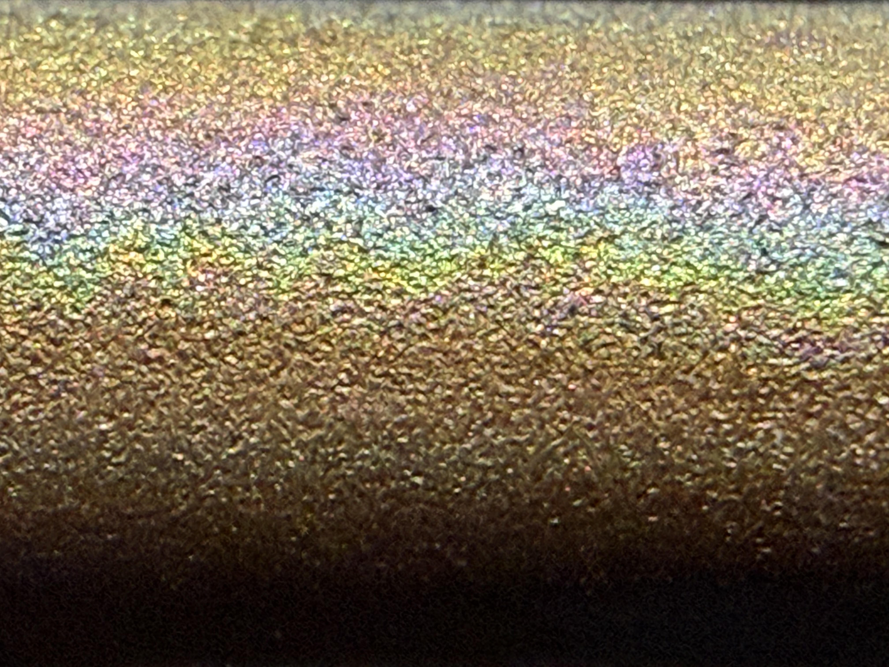

# Joint in-person training

## Logistics

Initial in-person training was provided by AMYBO's Dr Martin Currie for both Imperial College and Edinburgh students at Edinburgh University's Chris French Laboratory from 18-21 November 2025.
<!-- TODO: let me know if you'd like your names mentioned here and I'll add them, we could also link to our LinkedIn profiles or link-in-bios if you like | assignee: @Bingqiao @Amir @Teo -->

## Assembly and Calibration

### Procedure

The main focus of the training was assembly and calibration of three AEP0.1 prototypes following the [AEP0.1_Assembly.md](AsepticElectroPioreactor/CARMA_PumpPriming/Assembly/AEP0.1_Assembly.md) guide.  One prototype was assembled by each of the three students.

### Software issues

Following the documented software installation, we were unable to SSH into the AEPs.  This issue took a long time to diagnose and required consultation with Labcrafter and Pioreactor.  We initially conflated the issue with a trivial LED not lighting issue which was resolved by Pioreactor in that day's nightly Pioreactor software build. Cameron Davidson-Pilon of Pioreactor found that it was due to an [issue with the Raspberry Pi Imager](https://github.com/raspberrypi/rpi-imager/issues/1170) which was resolved by using an earlier version of the Imager.

### Assembly issues

Improvements to the assembly procedures were made during the course of the training.  See [Other Issues](#other-issues) below for the most significant examples.

## Media

Media was made up as per [MediaFormulation.md 2025-11-12](https://github.com/amy-bo/electroPioreactor/blob/ba442ae67962f1ee57649e94e9f0302e0077b55f/Media/MediaFormulation.md)<!-- TODO: insert variations from MediaFormulation.md 2025-11-12 | assignee: @Bingqiao or anyone who noted details -->.

Versions were sterilised by autoclaving and by filter sterilisation.
<!-- TODO: define filter type - was it 0.2 μm? what material? | assignee: @Bingqiao or anyone who noted details -->
<!-- TODO: detail the media discolouration and precipitation issues | assignee: @Bingqiao or anyone who noted details -->

## Heterotrophic culture

A heterotrophic culture of Cupriavidus metallidurans was established using the above Media plus gluconic acid (sodium salt) as the carbon and energy source.

<!-- TODO: insert results | assignee: @Bingqiao or anyone who noted them -->

## Sparging

The system was set up for continuous sparging of CO₂, however this presented three issues:

### 1. Water in CO₂ lines

The bubble counters, when set up as per manufacturers instructions, resulted in rising bubbles passing water into the downstream CO₂ lines.  This was unacceptable as over time it would impact the hydrophobic gas filters.

Various configurations were discussed and a number of them tested.  Replacing the distilled water with mineral oil improved the situation, but still required a restrictively low gas flow to ensure no mineral oil entered the downstream CO₂ lines.

### 2. Oxygen Purging Sensitivity

The low flow rates of CO₂ made the positioning of the CO₂ sparging tube extremely critical in terms of O₂ bubble dislodgement from the anode.  An adaptation was made using o-rings to maintain the tube's location, however this may have adversely impacted fluid flow.

### 3. Optical Density Measurement Issues

While intermittent sparging previously triggered a postponement of optical density measurement, continuous sparging could not.  This meant that the bubbles could interfere with optical density measurement, which was then also highly sensitive to optical density measurement.

### Sparging Solution

It was decided that intermittent sparging should resume, this meant that the bubble counters were no longer required, that CO₂ bubbles take a much broader range of pathways, so the sparging tube's location was less critical.  This required a significant design change in order to avoid [CO backflow](PastResearch/Brown-HarrisLab/1.CO2backflowDiagnosis-EliSilver.md).

## Anode Discolouration

At the end of the experiments the platinum plated titanium anodes were noted to have discoloured to brown in the areas closest to the cathode, with rainbow discolouration further away:

## Other Issues

### Crocodile Clip Detachment

The new higher quality crocodile clips purchased for the cylindrical electrodes easily detached.  This inspired [Top Stop improvements](https://github.com/amy-bo/electroPioreactor/commit/e0ebc9f5677bb1e9d91fb322b1b6322d0b47057f) that remove the need for crocodile clips and reduce the risk of electrode polarity inversion.

### Suboptimal Raft Order

Traditionally AMYBO located the SodaStream cyclinder in the centre of the raft for stability.  However this makes the media bottles harder to observe in large rafts and results in excessive peristaltic pump tubing run lengths.  The raft was reoriented to place sodastream cylinders at back - this improved visibility and reduced peristaltic tubing run lengths.

### Vial Fragility

One of the [vials](https://labcrafter.co.uk/products/20ml-glass-vial-cap-s-with-ports-and-stir-bar) dropped and smashed. It would be prudent to carry boxed spares of critical components.

### Vial Cap O-Ring Dislodgement

The vial cap o-rings tended to fall out, making aseptic technique difficult.  This inspired a vial cap [design improvement](https://github.com/amy-bo/electroPioreactor/commit/88e3c8db04196599436d371a5588a67b8afb526a) with a lip to retain the o-ring.
