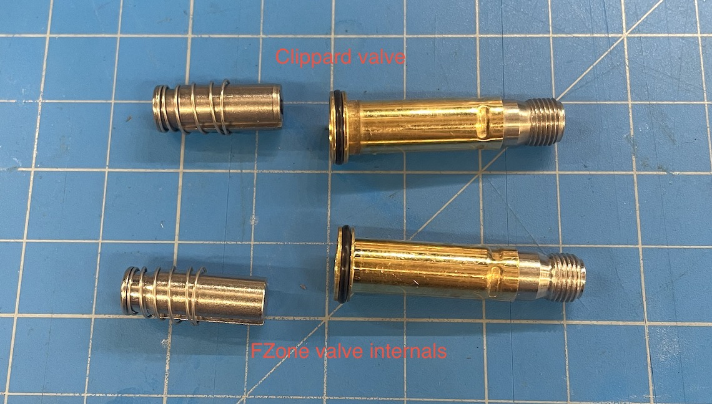
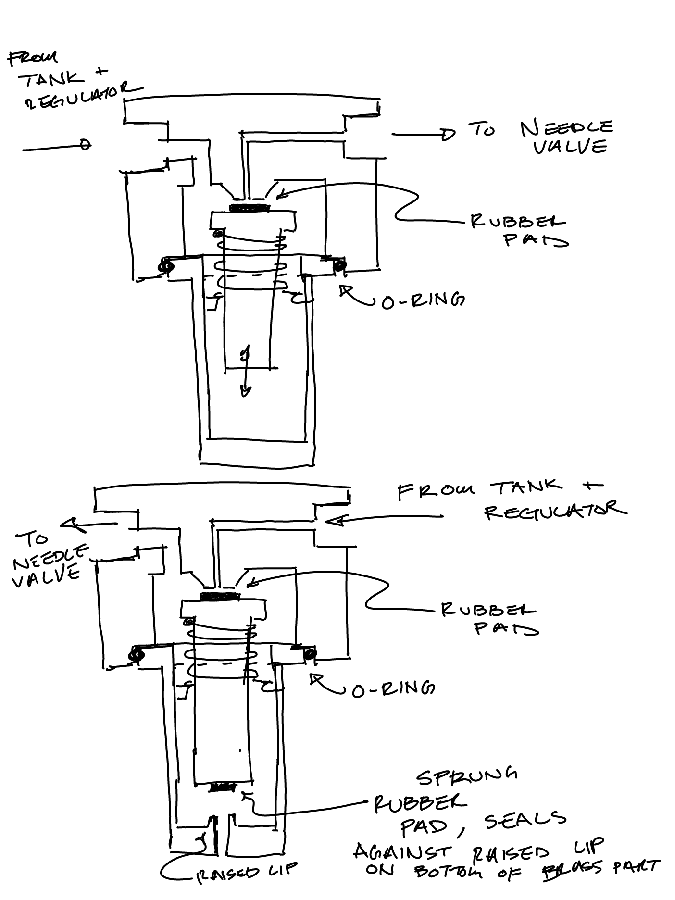

Eli was able to test with the FZone regulator and valve hooked up to their CO2 tank. This time he saw a backflow! 

The FZone solenoid valve, it turns out, does not have a vent. When the solenoid is open it connects the regulator to the needle valve. When closed it simply blocks the pathway between the two. Our other solenoid valve that on the outside looks very similar has some slight differences internally which I attempted to sketch out. The parts are actually interchangeable between the two valves, that's how similar they are. 

What Eli believes is happening is once you purge CO2 through the system and turn off the solenoid, there is trapped gas between the valve and the cell culture. This gas is pure CO2 since it came right out of the bottle and displaced any air in the tubing. Since CO2 is highly soluble in water, gas trapped between the valve and the culture begins to dissolve. This reduces the volume of gas in the tube, reducing the pressure and drawing the culture up towards the valve. The water does not quickly saturate with CO2 because excess CO2(l) will turn back into CO2(g) at the air/water interface in the vial, which just allows the CO2 in the tube to continue dissolving.

To test this, Eli used their solenoid valve but plugged the vent. With no vent, he immediately saw backflow. With the vent open, the tube from the regulator to the culture is no longer sealed at the other so as CO2 dissolves it draws air in through the vent. Sure enough, he did not see any backflow with the vented valve. 

Next steps: 
The most straightforward solution would be to look for a solenoid valve with a vent. I haven't done any product research on this, but I imagine we can find a similarly priced valve with a vent. 

[2. Backflow testing with revised components - Eli Silver.md](2.%20Backflow%20testing%20with%20revised%20components%20-%20Eli%20Silver.md)